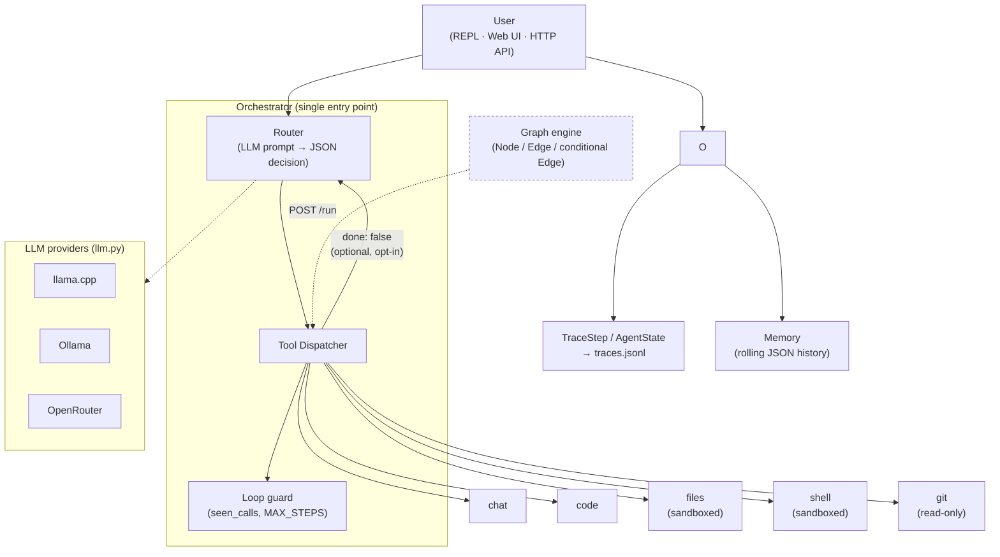

# Forge

[](https://github.com/Kurtisone/forge/actions/workflows/ci.yml)

Forge is a lightweight LLM-based agent runtime built around a router + tool execution model.
Instead of relying on a monolithic prompt or complex reasoning loops, Forge delegates actions
to explicit tools selected by a structured LLM router.

---

### Core Concept

```
User Input
   ↓
LLM Router  (structured JSON decision)
   ↓
Tool Dispatcher
   ├── chat     (conversational response)
   ├── code     (code generation)
   ├── files    (sandboxed read/write/list)
   ├── shell    (sandboxed subprocess)
   └── git      (read-only git operations)
```

The model must output a strict JSON instruction (`{"tool": "...", "content": "..."}`)
describing which tool to invoke. The router is resilient: it handles JSON,
XML tool-call format (Qwen HERETIC), markdown code fences, and plain text as
fallbacks, in that order. Repeated tokens, leaked prompt instructions, and
empty outputs are detected and replaced with a clean placeholder.

---

### Architecture

Forge enforces a strict separation between three layers: the **LLM**
(router prompt + providers), **tools** (dispatch + handlers), and **logs**
(the only module allowed to print anything). The orchestrator is the single
point where they meet. From v3.0, execution can also be expressed as a
**Graph** of typed nodes connected by conditional edges.



GitHub renders this diagram automatically; if you're reading this elsewhere, the ASCII
directory tree below covers the same layering.

```
src/forge/
│
├── orchestrator.py      # single orchestrator — MAX_STEPS loop guard + cycle detection + real multi-step (see below)
├── llm.py               # LLM dispatch — called from nowhere else
├── config.py            # sole reader of os.getenv()
├── logger.py            # sole logger; SHOW_DEBUG gates structured trace events
├── errors.py            # typed exception hierarchy (ForgeError, ProviderError, …)
├── types.py             # AgentState / RouterDecision / ToolResult / TraceStep dataclasses
├── trace.py             # JSONL execution trace — one record per run, append-only
│
├── graph.py             # Node / Edge / Graph execution engine
├── graphs/
│   ├── default.py       # router → dispatch → fallback (drop-in for Orchestrator)
│   └── review.py        # read_file → llm_review (chains filesystem + LLM)
│
├── router/
│   ├── prompt.py        # router prompt template — isolated; nothing else builds prompts
│   └── parser.py        # raw LLM output → RouterDecision (5-step cascade)
│
├── tools/
│   ├── registry.py      # discovery + ENABLED_TOOLS allowlist; failures logged, never swallowed
│   ├── chat.py
│   ├── code.py
│   ├── files.py         # sandboxed read/write/list within WORKSPACE_DIR
│   ├── shell.py         # sandboxed subprocess within WORKSPACE_DIR + allowlist
│   └── git.py           # read-only git operations (status/diff/log/show/branch)
│
├── memory.py            # JSON-backed rolling history + key/value facts
├── api.py               # FastAPI HTTP server (chat, review, run, traces, tools)
├── cli.py               # forge review <file> / forge replay <run_id>
│
└── providers/
    ├── llama_cpp.py
    ├── ollama.py
    └── openrouter.py
```

Data flow per turn (orchestrator):
```
user_input
   ↓
Orchestrator._route()      →  RouterDecision   (LLM layer)
   ↓
Orchestrator._dispatch()   →  ToolResult       (tools layer)
   ↓
done? ──no──→  fold result into history  ──→  route again (up to MAX_STEPS)
   │
  yes
   ↓
AgentResult + TraceStep                         (returned to caller + written to traces.jsonl)
```

**Multi-step is opt-in and backward compatible.** The router's JSON can include
`"done": false` to ask for another step; the tool's result is folded into history as
context for the next routing decision. The field defaults to `true`, so every
extraction path that predates it — plain JSON without `done`, the XML tool-call
format, markdown-fence fallback, plain-text fallback — still returns after exactly
one step, exactly as before. A failed step always stops the run regardless of `done`,
and the existing `seen_calls` loop guard applies across every step, not just within one.

```json
{"tool": "code", "content": "print(1)", "done": false}
```


Data flow per turn (graph):
```
user_input + initial_context
   ↓
Graph.run()  →  Node A  →  Node B  →  … →  terminal node
                  ↓ conditional edges ↑
AgentState.final_output  (+ full trace in AgentState.trace)
```

---

### Usage

```bash
cp .env.example .env.local   # then edit if you need to override any default
```

`podman build` below picks up the `Containerfile` in the repo root automatically
(podman's native name — no `-f` flag needed). It defaults to serving the API.

**Container networking:** the default LLM backends (llama.cpp on `:8080`,
Ollama on `:11434`) are meant to run on the **host**, not inside the
container. From inside a container, `127.0.0.1` means the container itself.
Point `LLAMA_CPP_URL`/`OLLAMA_URL` in `.env.local` at
`http://host.containers.internal:8080` (podman) instead — already the
convention used by this repo's own `.env.local` setups.

**API server (recommended — accessible from browser and any device on the network):**

```bash
podman build -t forge-core .
podman run -d --name forge \
  --env-file .env.local \
  -v $(pwd)/data:/app/data \
  -p 8000:8000 \
  forge-core

# Open in browser (same machine or any device on the same network)
open http://localhost:8000
open http://<host-ip>:8000
```

Exposing this beyond localhost or a trusted LAN? Set `API_TOKEN` in `.env.local`
first — see [Configuration](#configuration) and [API Endpoints](#api-endpoints).

**REPL (interactive terminal, local only):**

```bash
podman run -it --rm \
  --env-file .env.local \
  -v $(pwd)/data:/app/data \
  forge-core python -m forge.main
```

REPL commands: `!help`, `!clear`, `!trace`. Multi-line paste: type your question
then append ` ``` ` or paste question + code in one go (auto-detected via `select()`).

**CLI (one-shot commands, no REPL):**

```bash
# Review a file
podman run --rm --env-file .env.local \
  -v $(pwd):/workspace forge-core \
  python -m forge.cli review src/forge/main.py "Que peut-on améliorer ?"

# Replay a past execution trace
python -m forge.cli replay <run_id>
```

---

### API Endpoints

| Method | Path | Auth | Description |
|---|---|---|---|
| `GET` | `/` | open | Web UI |
| `GET` | `/health` | open | Provider + model info |
| `POST` | `/chat` | optional | Single conversation turn |
| `POST` | `/review` | optional | File content analysis |
| `POST` | `/run` | optional | Run any graph by name |
| `GET` | `/tools` | optional | Active tools + available graphs |
| `GET` | `/traces?n=10` | optional | Recent execution traces |
| `GET` | `/docs` | open | Interactive API docs (Swagger) |

**Auth:** set `API_TOKEN` in the environment to require
`Authorization: Bearer <token>` on every "optional" route above. Unset (the
default), the API is exactly as open as before this existed — nothing changes
unless you opt in. `/` and `/health` always stay open, for the UI shell and
monitoring probes. The web UI has a 🔑 **Token** button in the header that
prompts for the token and remembers it (localStorage) for subsequent requests.

**Rate limiting:** the same "optional" routes are also behind an in-memory
sliding-window limiter — `RATE_LIMIT_REQUESTS` per `RATE_LIMIT_WINDOW_SECONDS`
per client IP (default: 30 per 60s), `429 Too Many Requests` with a
`Retry-After` header past that. No external service (no redis) — a plain
process-local counter, single-worker only: running uvicorn with multiple
workers gives each its own counter. Set `RATE_LIMIT_ENABLED=false` to disable,
e.g. behind a proxy that already rate-limits.

**`POST /run` example:**
```json
{ "graph": "review", "input": "src/forge/main.py", "context": {"question": "Security issues?"} }
```

---

### Configuration

| Variable | Description | Default |
|---|---|---|
| `FORGE_PROVIDER` | LLM backend: `llama_cpp`, `ollama`, `openrouter` | `llama_cpp` |
| `LLM_MODEL` | Model name | `default` |
| `OLLAMA_URL` | Ollama endpoint | `http://127.0.0.1:11434/api/generate` |
| `LLAMA_CPP_URL` | llama.cpp endpoint | `http://127.0.0.1:8080` |
| `LLAMA_CPP_N_PREDICT` | Max tokens per llama.cpp response | `512` |
| `LLAMA_CPP_TIMEOUT` | HTTP timeout for llama.cpp requests (seconds) | `120` |
| `LLAMA_CPP_USE_GRAMMAR` | GBNF grammar-constrained decoding for llama.cpp — forces output to match the router's JSON schema at the sampling level | `true` |
| `OPENROUTER_URL` | OpenRouter endpoint | `https://openrouter.ai/api/v1/chat/completions` |
| `OPENROUTER_API_KEY` | OpenRouter API key | *(empty)* |
| `MAX_STEPS` | Hard ceiling on router→tool steps per run (multi-step only happens if the router sends `"done": false`) | `1` |
| `ENABLED_TOOLS` | Comma-separated allowlist of dispatchable tools | `chat,code` |
| `WORKSPACE_DIR` | Root directory for files + shell tools | `data/workspace` |
| `SHELL_TIMEOUT` | Max seconds for a shell tool command | `30` |
| `SHELL_ALLOWED_COMMANDS` | Comma-separated command allowlist for the shell tool | `ls,cat,head,tail,wc,grep,find,python3,pip,pytest` |
| `MEMORY_ENABLED` | Persist and recall conversation history | `true` |
| `MEMORY_FILE` | Path to the JSON memory file | `data/memory.json` |
| `MEMORY_MAX_HISTORY` | Number of past messages kept in the prompt | `20` |
| `TRACE_ENABLED` | Write JSONL execution trace per run | `true` |
| `TRACE_FILE` | Path to the JSONL trace file | `data/traces.jsonl` |
| `SHOW_DEBUG` | Emit full structured trace to stderr (prompt, raw output, timings) | `false` |
| `API_TOKEN` | Bearer token required on `/chat`, `/review`, `/run`, `/tools`, `/traces`. Empty = API stays open | *(empty)* |
| `RATE_LIMIT_ENABLED` | In-memory sliding-window rate limit on the same routes as `API_TOKEN` | `true` |
| `RATE_LIMIT_REQUESTS` | Max requests per client IP per window | `30` |
| `RATE_LIMIT_WINDOW_SECONDS` | Window size in seconds | `60` |

---

### Tools

| Tool | Activated by | Description |
|---|---|---|
| `chat` | default | Conversational response |
| `code` | default | Code generation |
| `files` | `ENABLED_TOOLS=chat,code,files` | Sandboxed read/write/list within `WORKSPACE_DIR` |
| `shell` | `ENABLED_TOOLS=chat,code,shell` | Subprocess execution within `WORKSPACE_DIR` + `SHELL_ALLOWED_COMMANDS` |
| `git` | `ENABLED_TOOLS=chat,code,git` | Read-only git operations (status, diff, log, show, branch) |

A tool is only dispatchable if it has a `run()` function **and** appears in `ENABLED_TOOLS`.
Implementing `run()` in a module is not enough — the opt-in is intentional for tools with side effects.

**Router reachability (v3.5):** the router's own prompt and validation are generated from
`ENABLED_TOOLS` — every enabled tool is offered as a routing option in normal conversation,
not only via an explicit [Graph](#architecture) (`POST /run`). Before v3.5, `files`/`shell`/`git`
were reachable only through a Graph even when enabled, because the router's prompt and JSON
validation hardcoded exactly `{"chat", "code"}` regardless of `ENABLED_TOOLS`. Nothing about the
opt-in itself changed: a tool still has to be listed in `ENABLED_TOOLS` to be reachable either way,
and each tool's own sandboxing (allowlist, timeout, `WORKSPACE_DIR` confinement, git's read-only
subcommand list) applies the same regardless of how it's invoked.

**Grammar-constrained decoding (v3.6, llama.cpp only):** by default, the router's llama.cpp
requests include a GBNF grammar ([`router/grammar.py`](src/forge/router/grammar.py)) that
constrains sampling to the router's exact JSON schema — the model cannot emit tokens for
hallucinated dialogue turns, leaked prompt text, or malformed JSON, because those tokens simply
aren't valid at that point in the grammar. This was added after a real failure mode: with a long
enough prompt (many enabled tools) and a stale conversation history in context, a model would
occasionally answer a *fictional* follow-up question instead of the real one, or emit nothing
usable at all — the router's fallback chain caught it, but a placeholder isn't a good answer.
Grammar constraint stops that class of failure before it starts, at the cost of being provider-
specific (only llama.cpp exposes raw GBNF sampling this way — Ollama has a coarser `"format":
"json"`, OpenRouter has `response_format`, neither can pin `tool` to a specific set of literal
values). Set `LLAMA_CPP_USE_GRAMMAR=false` if your server version doesn't support the `grammar`
completion field, or to rule it out while debugging — the prompt-engineering + parser fallback
chain underneath it all is unchanged and still does the same job on its own, just with a higher
failure rate on a stressed prompt.

**Why `/chat` isn't streamed (yet):** for `tool="chat"`, the router's single LLM call already
*is* the answer — `content` in `{"tool":"chat","content":"..."}` is generated in the same call as
the routing decision, and `tools/chat.py` just returns it unchanged. Streaming that content would
mean streaming tokens before the JSON (and therefore the tool choice) is even complete — and the
parser deliberately prefers the *last* complete JSON object it finds, not the first, because small
local models sometimes echo earlier conversation before producing the real answer. Streaming
token-by-token would risk showing stale/wrong content that then gets silently replaced — worse
UX than no streaming. Real streaming needs decision and generation split into two LLM calls (a
fast classify-only call, then a separate streamed generation call once the tool is known) — a
real latency trade-off on already-slow local hardware, planned for v3.7.

---

### Memory

Forge keeps a rolling window of the last `MEMORY_MAX_HISTORY` messages in `MEMORY_FILE`
and injects it as context into the router prompt on every turn.

Storage is plain JSON — no schema, no migrations, `cat data/memory.json` to inspect it.
Only genuine answers are persisted: a dispatch failure (`result.ok=False`) is never written,
and neither is a router-generated placeholder (empty/garbled model output, a detected repetition
loop, or leaked prompt instructions) — those succeed at dispatch (`chat` trivially echoes
whatever content it's given) but aren't real answers, and saving one as if it were would feed
it back into the next prompt as context, which can make a model that got confused once more
likely to get confused again on the very next turn.
Large pastes are truncated to 300 chars before saving to avoid bloating future prompts.

---

### Execution Traces

Every run appends a record to `TRACE_FILE` (default: `data/traces.jsonl`):

```bash
tail -n1 data/traces.jsonl | python3 -m json.tool
# or inside the REPL:
!trace
# or via the API:
GET /traces?n=5
```

Each record contains: `run_id`, `timestamp`, `user_input_preview`, per-step tool + duration,
`total_ms`, `ok`, `error`.

---

### Continuous Integration

Every push to `main` and every PR targeting it runs, via GitHub Actions
(`.github/workflows/ci.yml`):

```bash
ruff check .
pytest tests/ -v
```

Same commands locally, after `pip install -r requirements-dev.txt`.

---

### Design Philosophy

- **Deterministic routing over free-form reasoning** — the model picks a tool from a fixed set,
  not an open-ended plan.
- **Explicit tool activation** — a tool requires `run()` *and* an `ENABLED_TOOLS` opt-in.
  Code existing is not enough; side-effect tools are never silently reachable.
- **Typed boundaries** — `AgentState`, `RouterDecision`, `ToolResult`, `TraceStep` at every
  interface; raw dicts never cross module boundaries.
- **Best-effort memory and trace** — failures are logged and ignored; they never break a turn.
- **Local-first** — llama.cpp and Ollama are first-class backends; no cloud dependency required.
- **Graph over magic** — multi-step flows are expressed as explicit `Node/Edge/Graph` structures,
  not as implicit LLM reasoning loops.

---

### Roadmap

| Version | Status | Focus |
|---|---|---|
| **v2.2** | done | Clean Runtime: typed errors, centralized logger, provider split, loop guard |
| **v2.3** | done | Robustness: parser cascade, memory hardening, REPL paste detection, ENABLED_TOOLS allowlist |
| **v2.4** | done | Structured execution trace: `AgentState`, `TraceStep`, JSONL trace file, `!trace` |
| **v3.0** | done | Graph execution engine: `Node/Edge/Graph`, conditional edges, `AgentState.context` |
| **v3.1** | done | HTTP API + web UI, review graph, `forge review` CLI, sandboxed files tool |
| **v3.2** | done | Shell tool, git tool, `POST /run`, Tools tab in UI |
| **v3.3** | done | Hardening: real multi-step orchestrator, CI (ruff + pytest), optional API bearer-token auth |
| **v3.4** | done | Portfolio: architecture diagram, `.env.example`, LinkedIn writeup |
| **v3.5** | done | Test coverage (llm/cli/trace: 26-39% → 98-100%), router reachable to files/shell/git, API rate limiting |
| **v3.6** | current | Response quality: GBNF grammar-constrained decoding for llama.cpp |
| **v3.7** | planned | True token streaming for `/chat` (needs decision/generation split — see Architecture notes) |

---

### Status

Forge is an experimental local runtime, not a production framework.
The public API (orchestrator, tool registry, providers, graph engine) is stabilising from v3.0 onward.

---

### License

MIT
