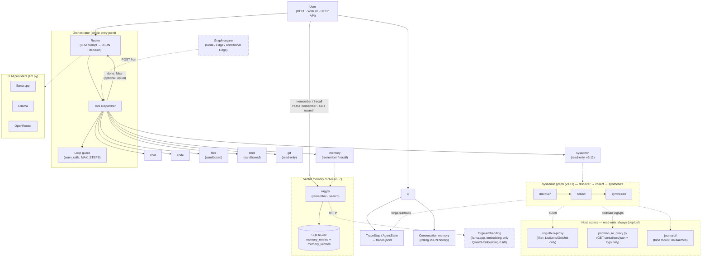

# Forge

[](https://github.com/Kurtisone/forge/actions/workflows/ci.yml)

Forge is a lightweight LLM-based agent runtime built around a router + tool execution model.
Instead of relying on a monolithic prompt or complex reasoning loops, Forge delegates actions
to explicit tools selected by a structured LLM router.

---

### Core Concept

```
User Input
   ↓
LLM Router  (structured JSON decision)
   ↓
Tool Dispatcher
   ├── chat        (conversational response)
   ├── code        (code generation)
   ├── files       (sandboxed read/write/list)
   ├── shell       (sandboxed subprocess)
   ├── git         (read-only git operations)
   ├── memory      (remember/recall, vector search)
   ├── test        (sandboxed pytest/ruff runner)
   ├── review      (read a file, optionally test it, analyze)
   ├── web_fetch   (fetch a known URL)
   ├── web_search  (SearXNG links/snippets, no synthesis)
   ├── research    (search → fetch → synthesize, one call)
   └── sysadmin    (discover → collect → synthesize, read-only diagnosis)
```

The model must output a strict JSON instruction (`{"tool": "...", "content": "..."}`)
describing which tool to invoke. The router is resilient: it handles JSON,
XML tool-call format (Qwen HERETIC), markdown code fences, and plain text as
fallbacks, in that order. Repeated tokens, leaked prompt instructions, and
empty outputs are detected and replaced with a clean placeholder.

---

### Architecture

Forge enforces a strict separation between three layers: the **LLM**
(router prompt + providers), **tools** (dispatch + handlers), and **logs**
(the only module allowed to print anything). The orchestrator is the single
point where they meet. From v3.0, execution can also be expressed as a
**Graph** of typed nodes connected by conditional edges.


```mermaid
flowchart TD
    U["User<br/>(REPL · Web UI · HTTP API)"] --> O

    subgraph Orchestrator["Orchestrator (single entry point)"]
        direction TB
        R["Router<br/>(LLM prompt → JSON decision)"]
        D["Tool Dispatcher"]
        LG["Loop guard<br/>(seen_calls, MAX_STEPS)"]
        R --> D
        D -->|"done: false<br/>(optional, opt-in)"| R
        D --> LG
    end

    U --> R

    D --> T1[chat]
    D --> T2[code]
    D --> T3["files<br/>(sandboxed)"]
    D --> T4["shell<br/>(sandboxed)"]
    D --> T5["git<br/>(read-only)"]
    D --> T6["memory<br/>(remember / recall)"]
    D --> T7["sysadmin<br/>(read-only, v3.11)"]

    subgraph Providers["LLM providers (llm.py)"]
        direction LR
        P1[llama.cpp]
        P2[Ollama]
        P3[OpenRouter]
    end
    R -.-> Providers

    O --> TR["TraceStep / AgentState<br/>→ traces.jsonl"]
    O --> MEM["Conversation memory<br/>(rolling JSON history)"]

    G["Graph engine<br/>(Node / Edge / conditional Edge)"] -.->|POST /run| D
    style G stroke-dasharray: 4 3

    subgraph RAG["Vector memory / RAG (v3.7)"]
        direction TB
        RE["rag.py<br/>(remember / search)"]
        VDB[("SQLite-vec<br/>memory_entries + memory_vectors")]
        RE --> VDB
    end

    U -->|"!remember / !recall<br/>POST /remember · GET /search"| RE
    T6 -.-> RE
    EMB["forge-embedding<br/>(llama.cpp, embedding-only<br/>Qwen3-Embedding-0.6B)"]
    RE -.->|HTTP| EMB
    style RAG stroke-dasharray: 4 3
    style EMB stroke-dasharray: 4 3

    subgraph Sysadmin["sysadmin graph (v3.11) — discover → collect → synthesize"]
        direction LR
        SD[discover] --> SC[collect] --> SS[synthesize]
    end
    T7 -.-> Sysadmin
    Sysadmin -.->|forge.subtrace| TR
    style Sysadmin stroke-dasharray: 4 3

    subgraph HostProxies["Host access — read-only, always (deploy/)"]
        direction LR
        DBUS["xdg-dbus-proxy<br/>(filter: ListUnits/GetUnit only)"]
        PODP["podman_ro_proxy.py<br/>(GET containers/json + logs only)"]
        JRNL["journalctl<br/>(bind mount, no daemon)"]
    end
    Sysadmin -.->|busctl| DBUS
    Sysadmin -.->|podman logs/ps| PODP
    Sysadmin -.-> JRNL
    style HostProxies stroke-dasharray: 4 3
```

#### The Kernel layer

Dispatch does not look tools up directly any more. Both execution paths — the
orchestrator and the graph engine — ask the **Capability Registry** which
providers answer for a capability name, then consult the **Policy Engine**
before running one. This is Niveau 2 of the trajectory in
[ARCHITECTURE.md](ARCHITECTURE.md), and it is deliberately the whole of it:
there is no Scheduler yet, because nothing yet needs one.

```
Router decision
      │
      ▼
Capability Registry ──► candidates(name)
      │                 (lists; never chooses)
      ▼
Policy Engine ────────► Verdict(allowed, reason)
      │
      ▼
capability.execute(content) ──► ToolResult
```

The Registry is a **view**, not a snapshot: it derives capabilities from the
enabled tool set at call time and resolves the handler at execution time, so
it cannot go stale. It has no `resolve()` / `best()` / `pick()` — listing and
choosing are different jobs, and choosing belongs to the Cognitive Scheduler
that does not exist yet. A capability with two providers is a hard error today
rather than an implicit pick of the first.

Each tool declares a `REQUIREMENTS` constant: four statically knowable facts
(reaches the Internet, calls the LLM itself, writes to the workspace, spawns a
process). They are declarations, not measurements — cost, latency and quality
scores arrive when something measures them, not before. A tool that declares
nothing gets the most demanding profile and is flagged, so omission is never
mistaken for harmlessness.

```
$ forge capabilities
14 capabilities registered
policy: denying network

   CAPABILITY  PROVIDER    REQUIRES
   chat        chat        local, read-only
   code        code        local, read-only
   delegate    delegate    llm
   files       files       writes
   git         git         subprocess
   memory      memory      local, read-only
   recall      recall      llm
 x research    research    network, llm
   review      review      llm
 x shell       shell       network, llm, writes, subprocess
   sysadmin    sysadmin    llm, subprocess
   test        test        writes, subprocess
 x web_fetch   web_fetch   network
 x web_search  web_search  network

x 4 capabilities are blocked by the active policy and will refuse to run.
```

The Policy Engine is a deny gate over those declarations, and it only ever
subtracts from what `ENABLED_TOOLS` already allows. Its use is context, not
containment — the real sandboxing stays in the tools themselves (`web_fetch`'s
SSRF guard, `files`' workspace confinement, `shell`'s allowlist). Off the
network that hosts SearXNG, `POLICY_ALLOW_NETWORK=false` makes `research` and
`web_search` refuse with a stated reason instead of failing later with a
connection error, while `chat`, `code`, `memory` and `review` keep working.

GitHub renders this diagram automatically; if you're reading this elsewhere, the ASCII
directory tree below covers the same layering.

```
src/forge/
│
├── orchestrator.py      # single orchestrator — MAX_STEPS loop guard + cycle detection + real multi-step (see below)
├── llm.py               # LLM dispatch — called from nowhere else
├── config.py            # sole reader of os.getenv()
├── logger.py            # sole logger; SHOW_DEBUG gates structured trace events
├── errors.py            # typed exception hierarchy (ForgeError, ProviderError, …)
├── types.py             # AgentState / RouterDecision / ToolResult / TraceStep dataclasses
├── trace.py             # JSONL execution trace — one record per run, append-only
│
├── graph.py             # Node / Edge / Graph execution engine
├── graphs/
│   ├── default.py       # router → dispatch → fallback (drop-in for Orchestrator)
│   ├── review.py        # read_file → [run_tests] → llm_review (optional test_path adds the middle step)
│   ├── research.py      # search → fetch top N → synthesize, one deterministic call (v3.10)
│   └── sysadmin.py      # discover → collect → synthesize, read-only always (v3.11)
├── text_cleaning.py     # shared plain-text response cleaning (review.py + research.py + sysadmin.py)
├── subtrace.py          # contextvar side-channel: graph-based tools publish internal
│                         # node steps for the UI without widening the str-only tool contract (v3.11)
│
├── router/
│   ├── prompt.py        # router prompt template — isolated; nothing else builds prompts
│   └── parser.py        # raw LLM output → RouterDecision (5-step cascade)
│
├── tools/
│   ├── registry.py      # discovery + ENABLED_TOOLS allowlist; failures logged, never swallowed
│   ├── chat.py
│   ├── code.py
│   ├── files.py         # sandboxed read/write/list within WORKSPACE_DIR
│   ├── shell.py         # sandboxed subprocess within WORKSPACE_DIR + allowlist
│   ├── git.py           # read-only git operations (status/diff/log/show/branch) — no write counterpart, by design
│   ├── memory.py        # router-dispatchable remember/recall (v3.7) — same rag.py backend
│   ├── test.py          # sandboxed pytest/ruff runner, own allowlist (v3.10)
│   ├── review.py        # dispatchable wrapper around graphs/review.py (v3.10)
│   ├── web_fetch.py      # fetch a known URL, SSRF-guarded (v3.10)
│   ├── web_search.py    # SearXNG-backed search, links/snippets only (v3.10)
│   ├── research.py      # dispatchable wrapper around graphs/research.py (v3.10)
│   └── sysadmin.py      # dispatchable wrapper around graphs/sysadmin.py (v3.11)
│
├── memory.py            # JSON-backed rolling conversation history + key/value facts
├── rag.py               # SQLite-vec vector memory for decisions/todos (v3.7) — separate concern from memory.py
├── api.py               # FastAPI HTTP server (chat, review, run, traces, tools, remember, search)
├── cli.py               # forge review <file> [--tests <path>] / forge replay <run_id> / forge capabilities
├── main.py              # REPL — !clear, !trace, !remember, !recall, !help
│
├── kernel/              # Capability layer — see ARCHITECTURE.md
│   ├── capability.py    # Capability interface, Requirements, ToolCapability
│   ├── registry.py      # Capability Registry — lists candidates, never chooses
│   └── policy.py        # Policy Engine — deterministic deny gate, explained verdicts
│
└── providers/
    ├── llama_cpp.py
    ├── ollama.py
    └── openrouter.py
```

`deploy/` (repo root, outside `src/forge/`) holds the read-only host-access
pieces `sysadmin` needs to reach real `journalctl`/`systemctl`/`podman` state
(v3.11) — see [`deploy/README.md`](deploy/README.md) for the full design and
[the section below](#usage) for the setup command.

Data flow per turn (orchestrator):
```
user_input
   ↓
Orchestrator._route()      →  RouterDecision   (LLM layer)
   ↓
Orchestrator._dispatch()   →  ToolResult       (capability + policy, then tools layer)
   ↓
done? ──no──→  fold result into history  ──→  route again (up to MAX_STEPS)
   │
  yes
   ↓
AgentResult + TraceStep                         (returned to caller + written to traces.jsonl)
```

**Multi-step is opt-in and backward compatible.** The router's JSON can include
`"done": false` to ask for another step; the tool's result is folded into history as
context for the next routing decision. The field defaults to `true`, so every
extraction path that predates it — plain JSON without `done`, the XML tool-call
format, markdown-fence fallback, plain-text fallback — still returns after exactly
one step, exactly as before. A failed step always stops the run regardless of `done`,
and the existing `seen_calls` loop guard applies across every step, not just within one.

```json
{"tool": "code", "content": "print(1)", "done": false}
```


Data flow per turn (graph):
```
user_input + initial_context
   ↓
Graph.run()  →  Node A  →  Node B  →  … →  terminal node
                  ↓ conditional edges ↑
AgentState.final_output  (+ full trace in AgentState.trace)
```

---

### Usage

```bash
cp .env.example .env.local   # then edit if you need to override any default
```

`podman build` below picks up the `Containerfile` in the repo root automatically
(podman's native name — no `-f` flag needed). It defaults to serving the API.

**Container networking:** the default LLM backends (llama.cpp on `:8080`,
Ollama on `:11434`) are meant to run on the **host**, not inside the
container. From inside a container, `127.0.0.1` means the container itself.
Point `LLAMA_CPP_URL`/`OLLAMA_URL` in `.env.local` at
`http://host.containers.internal:8080` (podman) instead — already the
convention used by this repo's own `.env.local` setups.

**API server (recommended — accessible from browser and any device on the network):**

```bash
podman build -t forge-core .
podman run -d --name forge \
  --env-file .env.local \
  -v $(pwd)/data:/app/data \
  -p 8000:8000 \
  forge-core

# Open in browser (same machine or any device on the same network)
open http://localhost:8000
open http://<host-ip>:8000
```

Exposing this beyond localhost or a trusted LAN? Set `API_TOKEN` in `.env.local`
first — see [Configuration](#configuration) and [API Endpoints](#api-endpoints).

**Optional: `sysadmin` host access (v3.11)** — mount the read-only proxies
and the journal to let `sysadmin` read the host's real
`journalctl`/`systemctl`/`podman` state instead of falling back to
kernel-only diagnosis:

```bash
./deploy/setup-sysadmin-host-access.sh   # one-time, idempotent

podman run -d --name forge \
  --group-add keep-groups \
  --env-file .env.local \
  -v $(pwd)/data:/app/data \
  -v /var/log/journal:/host-journal:ro \
  -v ${XDG_RUNTIME_DIR}/forge-dbus-proxy:/run/forge-dbus-proxy:ro \
  -v ${XDG_RUNTIME_DIR}/forge-podman-ro-proxy.sock:/run/forge-podman-ro-proxy.sock:ro \
  -p 8000:8000 \
  forge-core
```

(`--group-add keep-groups` — or the compose annotation
`run.oci.keep_original_groups: "1"` — is what lets `journalctl -u
<unit>` read root-owned system services; without it, `sysadmin` still
works but only sees generic queries and user-session units. See
[`deploy/README.md`](deploy/README.md#group-access-for-journalctl--u-on-root-owned-system-services)
for why.)

In `.env.local`:

```
SYSADMIN_JOURNAL_DIR=/host-journal
SYSADMIN_DBUS_ADDRESS=unix:path=/run/forge-dbus-proxy/bus
SYSADMIN_PODMAN_URL=unix:///run/forge-podman-ro-proxy.sock
SYSADMIN_MAX_LOG_LINES=100
```

Full design and troubleshooting: [`deploy/README.md`](deploy/README.md).

**REPL (interactive terminal, local only):**

```bash
podman run -it --rm \
  --env-file .env.local \
  -v $(pwd)/data:/app/data \
  forge-core python -m forge.main
```

REPL commands: `!help`, `!clear`, `!trace`, `!remember`, `!recall`. Multi-line paste: type your question
then append ` ``` ` or paste question + code in one go (auto-detected via `select()`).

**CLI (one-shot commands, no REPL):**

```bash
# Review a file
podman run --rm --env-file .env.local \
  -v $(pwd):/workspace forge-core \
  python -m forge.cli review src/forge/main.py "Que peut-on améliorer ?"

# Review a file and run its tests first (v3.10) -- test output becomes
# primary evidence for the review, not just the code itself
python -m forge.cli review src/forge/graph.py --tests tests/test_graph.py

# Replay a past execution trace
python -m forge.cli replay <run_id>
```

---

### API Endpoints

| Method | Path | Auth | Description |
|---|---|---|---|
| `GET` | `/` | open | Web UI |
| `GET` | `/health` | open | Provider + model info (for `llama_cpp`, the actually-loaded model, queried live from llama-server — see below) |
| `POST` | `/chat` | optional | Single conversation turn |
| `POST` | `/review` | optional | File content analysis, optionally running its tests first (`test_path` field, v3.10) |
| `POST` | `/run` | optional | Run any graph by name |
| `GET` | `/tools` | optional | Active tools + available graphs |
| `GET` | `/traces?n=10` | optional | Recent execution traces |
| `POST` | `/remember` | optional | Store a decision/todo in vector memory (v3.7) |
| `GET` | `/search?q=...` | optional | Semantic search over remembered decisions/todos |
| `GET` | `/history` | optional | Full rolling history with stable ids (v3.9) |
| `GET` | `/drawer` | optional | Currently pinned messages, the "tiroir" (v3.9) |
| `POST` | `/drawer/pin` | optional | Pin a message by id — pins its exchange partner too (v3.9) |
| `POST` | `/drawer/unpin` | optional | Unpin a message by id, independently of its partner (v3.9) |
| `POST` | `/compact` | optional | Force a context compaction pass now (v3.9) |
| `GET` | `/docs` | open | Interactive API docs (Swagger) |

**Auth:** set `API_TOKEN` in the environment to require
`Authorization: Bearer <token>` on every "optional" route above. Unset (the
default), the API is exactly as open as before this existed — nothing changes
unless you opt in. `/` and `/health` always stay open, for the UI shell and
monitoring probes. The web UI has a 🔑 **Token** button in the header that
prompts for the token and remembers it (localStorage) for subsequent requests.

**Rate limiting:** the same "optional" routes are also behind an in-memory
sliding-window limiter — `RATE_LIMIT_REQUESTS` per `RATE_LIMIT_WINDOW_SECONDS`
per client IP (default: 30 per 60s), `429 Too Many Requests` with a
`Retry-After` header past that. No external service (no redis) — a plain
process-local counter, single-worker only: running uvicorn with multiple
workers gives each its own counter. Set `RATE_LIMIT_ENABLED=false` to disable,
e.g. behind a proxy that already rate-limits.

**`POST /run` example:**
```json
{ "graph": "review", "input": "src/forge/main.py", "context": {"question": "Security issues?"} }
```

---

### Configuration

| Variable | Description | Default |
|---|---|---|
| `FORGE_PROVIDER` | LLM backend: `llama_cpp`, `ollama`, `openrouter` | `llama_cpp` |
| `LLM_MODEL` | Model name. For `ollama`/`openrouter` this is sent with every request and must match a real model. For `llama_cpp` it's **never sent** — llama-server always serves whatever GGUF it was launched with — so this value is only a fallback label for `/health`; `/health` queries llama-server's own `/props` for the live model name first and only falls back to this if that probe fails | `default` |
| `OLLAMA_URL` | Ollama endpoint | `http://127.0.0.1:11434/api/generate` |
| `LLAMA_CPP_URL` | llama.cpp endpoint | `http://127.0.0.1:8080` |
| `LLAMA_CPP_N_PREDICT` | Max tokens per llama.cpp response | `512` |
| `LLAMA_CPP_TIMEOUT` | HTTP timeout for llama.cpp requests (seconds) | `120` |
| `LLAMA_CPP_USE_GRAMMAR` | GBNF grammar-constrained decoding for llama.cpp — forces output to match the router's JSON schema at the sampling level | `true` |
| `LLAMA_CPP_ID_SLOT` | llama-server slot to pin every request to, so its KV cache can be reused across turns (v3.8) | `0` |
| `LLAMA_CPP_CACHE_PROMPT` | Ask llama-server to reuse its KV cache from the previous call's matching prefix (v3.8) | `true` |
| `OPENROUTER_URL` | OpenRouter endpoint | `https://openrouter.ai/api/v1/chat/completions` |
| `OPENROUTER_API_KEY` | OpenRouter API key | *(empty)* |
| `MAX_STEPS` | Hard ceiling on router→tool steps per run (multi-step only happens if the router sends `"done": false`) | `1` |
| `ENABLED_TOOLS` | Comma-separated allowlist of dispatchable tools | `chat,code` |
| `WORKSPACE_DIR` | Root directory for files + shell tools | `data/workspace` |
| `SHELL_TIMEOUT` | Max seconds for a shell tool command | `30` |
| `SHELL_ALLOWED_COMMANDS` | Comma-separated command allowlist for the shell tool | `ls,cat,head,tail,wc,grep,find,python3,pip,pytest` |
| `MEMORY_ENABLED` | Persist and recall conversation history | `true` |
| `MEMORY_FILE` | Path to the JSON memory file | `data/memory.json` |
| `MEMORY_MAX_HISTORY` | Hard-cap safety net on message count, behind compaction (v3.9) — pinned messages are exempt | `100` |
| `COMPACTION_ENABLED` | Replace old non-pinned messages with a summary once `COMPACTION_THRESHOLD` is crossed, instead of just dropping them (v3.9) | `true` |
| `COMPACTION_THRESHOLD` | Message count that triggers a compaction pass | `80` |
| `COMPACTION_KEEP_RECENT` | Most recent non-pinned messages always left untouched by compaction | `20` |
| `COMPACTION_STRATEGY` | `rag_pointer` (no LLM call, pushes the block into vector memory and leaves a pointer) or `llm_summary` (one LLM call, condenses inline) | `rag_pointer` |
| `TRACE_ENABLED` | Write JSONL execution trace per run | `true` |
| `TRACE_FILE` | Path to the JSONL trace file | `data/traces.jsonl` |
| `SHOW_DEBUG` | Emit full structured trace to stderr (prompt, raw output, timings) | `false` |
| `API_TOKEN` | Bearer token required on `/chat`, `/review`, `/run`, `/tools`, `/traces`. Empty = API stays open | *(empty)* |
| `RATE_LIMIT_ENABLED` | In-memory sliding-window rate limit on the same routes as `API_TOKEN` | `true` |
| `RATE_LIMIT_REQUESTS` | Max requests per client IP per window | `30` |
| `RATE_LIMIT_WINDOW_SECONDS` | Window size in seconds | `60` |
| `EMBEDDING_URL` | Embedding-only llama.cpp endpoint (separate instance from `LLAMA_CPP_URL`) for `/remember`, `/search` (v3.7) | `http://127.0.0.1:8082/embedding` |
| `EMBEDDING_DIM` | Embedding vector dimension, must match the served model | `1024` |
| `EMBEDDING_TIMEOUT` | HTTP timeout for embedding requests (seconds) | `30` |
| `RAG_DB_FILE` | Path to the SQLite-vec vector memory file | `data/forge_rag.db` |
| `TEST_TIMEOUT` | Max seconds for a test/lint tool command | `60` |
| `TEST_ALLOWED_COMMANDS` | Comma-separated command allowlist for the test tool — separate from `SHELL_ALLOWED_COMMANDS` on purpose | `pytest,ruff` |
| `WEB_FETCH_TIMEOUT` | HTTP timeout for `web_fetch` requests (seconds) | `15` |
| `WEB_FETCH_MAX_BYTES` | Raw response byte cap before truncation | `2097152` (2 MiB) |
| `WEB_FETCH_ALLOWED_DOMAINS` | Optional domain allowlist — empty means any public domain, subject to the (non-configurable) SSRF guard | *(empty)* |
| `SEARXNG_URL` | Self-hosted SearXNG instance for `web_search`/`research` — not a cloud API | `http://127.0.0.1:8888` |
| `SEARXNG_TIMEOUT` | HTTP timeout for SearXNG requests (seconds) | `10` |
| `SEARXNG_MAX_RESULTS` | Max results returned per search | `5` |
| `RESEARCH_FETCH_TOP_N` | How many top search results `research` fetches in full before synthesizing | `3` |
| `RESEARCH_FETCH_CHARS_PER_RESULT` | Per-result fetched-content cap fed into the synthesis prompt | `1500` |

---

### Tools

| Tool | Activated by | Description |
|---|---|---|
| `chat` | default | Conversational response |
| `code` | default | Code generation |
| `files` | `ENABLED_TOOLS=chat,code,files` | Sandboxed read/write/list within `WORKSPACE_DIR` |
| `shell` | `ENABLED_TOOLS=chat,code,shell` | Subprocess execution within `WORKSPACE_DIR` + `SHELL_ALLOWED_COMMANDS` |
| `git` | `ENABLED_TOOLS=chat,code,git` | Read-only git operations (status, diff, log, show, branch) — deliberately never gains a write counterpart reachable by the router: a commit/push has a real cost if the router hallucinates, so any git write stays a separate, human-confirmed flow outside tool dispatch, not a router decision |
| `memory` | `ENABLED_TOOLS=chat,code,memory` | Router-dispatchable RAG remember/recall (v3.7) |
| `test` | `ENABLED_TOOLS=chat,code,test` | Sandboxed pytest/ruff runner, own allowlist (`TEST_ALLOWED_COMMANDS`) separate from the shell tool's |
| `review` | `ENABLED_TOOLS=chat,code,review` | Reads a file (optionally runs its tests first) and returns an LLM analysis — "relis X et donne ton avis", not just "lis X" (see [Router reachability](#tools) note below on that exact ambiguity) |
| `web_fetch` | `ENABLED_TOOLS=chat,code,web_fetch` | Fetches a URL you already know — no search capability, SSRF-guarded, best-effort HTML→text extraction |
| `web_search` | `ENABLED_TOOLS=chat,code,web_search` | Ranked links/snippets from a self-hosted SearXNG instance — no synthesis, just the list |
| `research` | `ENABLED_TOOLS=chat,code,research` | Search → fetch top results → synthesize one answer, as a single deterministic call (see below) |
| `sysadmin` | `ENABLED_TOOLS=chat,code,sysadmin` | Discover → collect → synthesize: diagnoses a service/system problem from real logs, read-only always — never restarts/stops anything. Works kernel-log-only out of the box; see [`deploy/README.md`](deploy/README.md) for read-only proxies giving it real `journalctl`/`systemctl`/`podman` access |

A tool is only dispatchable if it has a `run()` function **and** appears in `ENABLED_TOOLS`.
Implementing `run()` in a module is not enough — the opt-in is intentional for tools with side effects.

**Router reachability (v3.5):** the router's own prompt and validation are generated from
`ENABLED_TOOLS` — every enabled tool is offered as a routing option in normal conversation,
not only via an explicit [Graph](#architecture) (`POST /run`). Before v3.5, `files`/`shell`/`git`
were reachable only through a Graph even when enabled, because the router's prompt and JSON
validation hardcoded exactly `{"chat", "code"}` regardless of `ENABLED_TOOLS`. Nothing about the
opt-in itself changed: a tool still has to be listed in `ENABLED_TOOLS` to be reachable either way,
and each tool's own sandboxing (allowlist, timeout, `WORKSPACE_DIR` confinement, git's read-only
subcommand list) applies the same regardless of how it's invoked.

**Grammar-constrained decoding (v3.6, llama.cpp only):** by default, the router's llama.cpp
requests include a GBNF grammar ([`router/grammar.py`](src/forge/router/grammar.py)) that
constrains sampling to the router's exact JSON schema — the model cannot emit tokens for
hallucinated dialogue turns, leaked prompt text, or malformed JSON, because those tokens simply
aren't valid at that point in the grammar. This was added after a real failure mode: with a long
enough prompt (many enabled tools) and a stale conversation history in context, a model would
occasionally answer a *fictional* follow-up question instead of the real one, or emit nothing
usable at all — the router's fallback chain caught it, but a placeholder isn't a good answer.
Grammar constraint stops that class of failure before it starts, at the cost of being provider-
specific (only llama.cpp exposes raw GBNF sampling this way — Ollama has a coarser `"format":
"json"`, OpenRouter has `response_format`, neither can pin `tool` to a specific set of literal
values). Set `LLAMA_CPP_USE_GRAMMAR=false` if your server version doesn't support the `grammar`
completion field, or to rule it out while debugging — the prompt-engineering + parser fallback
chain underneath it all is unchanged and still does the same job on its own, just with a higher
failure rate on a stressed prompt.

**Why `research` exists alongside `web_search` (v3.10):** a plain search only returns links and
snippets — turning that into an actual synthesized answer needs a second step (fetch a promising
result, then have the model write a real answer from it). Asking the router to decide that second
step itself proved unreliable in practice with a small local model: even with an explicit worked
JSON example showing exactly what to do next, it would sometimes just repeat the identical search
call instead, tripping the loop guard. Disabling `LLAMA_CPP_CACHE_PROMPT` and reproducing the same
failure ruled out a KV-cache bug — this is a genuine limit at multi-step self-correction for this
model class, not a fixable prompt or infra issue. `research` (`graphs/research.py`) removes the
decision from the router's hands entirely: search → fetch the top `RESEARCH_FETCH_TOP_N` results →
one synthesis call, run as a fixed sequence inside a single dispatchable call, the same pattern
already used by the `review` graph. `web_search` stays for when the user genuinely wants a list of
links/sources rather than an answer.

**Why `/chat` isn't streamed (yet):** for `tool="chat"`, the router's single LLM call already
*is* the answer — `content` in `{"tool":"chat","content":"..."}` is generated in the same call as
the routing decision, and `tools/chat.py` just returns it unchanged. Streaming that content would
mean streaming tokens before the JSON (and therefore the tool choice) is even complete — and the
parser deliberately prefers the *last* complete JSON object it finds, not the first, because small
local models sometimes echo earlier conversation before producing the real answer. Streaming
token-by-token would risk showing stale/wrong content that then gets silently replaced — worse
UX than no streaming. Real streaming needs decision and generation split into two LLM calls (a
fast classify-only call, then a separate streamed generation call once the tool is known) — a
real latency trade-off on already-slow local hardware. Deferred, no version scheduled yet:
v3.7 went to vector memory/RAG instead (see below), on the reasoning that Forge not knowing
the user's own decisions/projects mattered more than response latency.

---

### Conversation Memory

Forge keeps a rolling history in `MEMORY_FILE`, capped by `MEMORY_MAX_HISTORY`, and injects
it as context into the router prompt on every turn. Every message carries a stable `id` and
a `pinned` flag.

Storage is plain JSON — no schema, no migrations, `cat data/memory.json` to inspect it.
Only genuine answers are persisted: a dispatch failure (`result.ok=False`) is never written,
and neither is a router-generated placeholder (empty/garbled model output, a detected repetition
loop, or leaked prompt instructions) — those succeed at dispatch (`chat` trivially echoes
whatever content it's given) but aren't real answers, and saving one as if it were would feed
it back into the next prompt as context, which can make a model that got confused once more
likely to get confused again on the very next turn.
Content is persisted in full — nothing is truncated on the way in, so a large tool result
(reading a whole file, for instance) shows up complete both in the router's own context and
in the web UI's `GET /history`, not cut short.

#### Context compaction & drawer (v3.9)

`MEMORY_MAX_HISTORY` alone is a blunt instrument — a sliding window that drops the oldest
message every time a new one arrives once it's full, which also fights llama-server's prompt
cache reuse (v3.8) by shifting the whole history block on every eviction. `compaction.py` adds
a better mechanism ahead of that hard cap: once `COMPACTION_THRESHOLD` messages are reached,
the oldest non-pinned messages beyond `COMPACTION_KEEP_RECENT` are replaced by a single summary
message instead of being dropped outright. Two interchangeable strategies (`COMPACTION_STRATEGY`):
`rag_pointer` (default — no LLM call, pushes the block into vector memory verbatim and leaves a
short pointer, searchable via `!recall`/`/search`) or `llm_summary` (one LLM call, condenses the
block into prose kept inline). Both share the same signature, so switching is a config change,
not a rewrite. `POST /compact` (or `!compact` in the REPL) forces a pass on demand.

Any message can be pinned — the "tiroir" (`GET /drawer`, `POST /drawer/pin`/`unpin`) — which
exempts it from both compaction and the `MEMORY_MAX_HISTORY` hard cap. The web UI pins a
question and its answer together by default (an answer read back without its question, or vice
versa, tends to lose its point), but either half can be unpinned independently afterward.

---

### Vector Memory / RAG (v3.7)

Separate from conversation memory above: a place to deliberately store decisions and
TODOs and retrieve them later by meaning, not just by recency. Backed by
[sqlite-vec](https://github.com/asg017/sqlite-vec), a single file (`RAG_DB_FILE`,
default `data/forge_rag.db`) with two tables — `memory_entries` (the actual rows) and
`memory_vectors` (a `vec0` virtual table), linked by `rowid`.

Two ways in:

```bash
# REPL — captures a decision/todo without leaving the session
Forge > !remember decision forge Use SQLite-vec instead of an external vector DB
Forge > !recall how should I index embeddings
  [decision/forge] Use SQLite-vec instead of an external vector DB  (distance=0.234)

# HTTP API — same auth/rate-limiting as every other route
curl -X POST http://localhost:8000/remember \
  -H "Authorization: Bearer $API_TOKEN" -H "Content-Type: application/json" \
  -d '{"kind": "decision", "content": "Use SQLite-vec", "project": "forge"}'

curl "http://localhost:8000/search?q=vector+db&top_k=5" \
  -H "Authorization: Bearer $API_TOKEN"
```

Embeddings are generated by a **separate, embedding-only llama.cpp instance**
(`EMBEDDING_URL`, default `http://127.0.0.1:8082/embedding`) — distinct from
`LLAMA_CPP_URL`, which stays dedicated to chat/tool-dispatch. This project uses
Qwen3-Embedding-0.6B (q8_0), served with `--embeddings --pooling last` (required for
this model: decoder-only, aggregates via the EOS token rather than mean/cls pooling)
and `--embd-normalize 2` (L2-normalized, so distance in `/search` is a plain cosine
similarity). `EMBEDDING_DIM` must match whatever model you actually serve — 1024 for
Qwen3-Embedding-0.6B.

**A third entry point, autonomous this time:** with `memory` in `ENABLED_TOOLS`, the
router itself can dispatch a `remember`/`recall` without a human typing a command —
"Remember that we decided X" or "What did we decide about Y" gets routed there like
any other tool, using the exact same `forge/rag.py` backend as the REPL commands and
the API. The prompt (`TOOL_DESCRIPTIONS["memory"]` in `router/prompt.py`) tells the
model to use it only on an explicit ask, matching how `files`/`shell`/`git` are
scoped — in practice a plain declarative statement ("I have a Steam Deck") gets
treated as an implicit remember too, which is closer to what a personal-assistant
usage pattern actually wants; tighten the wording there if you'd rather require an
explicit cue.

`kind` is `"decision"`, `"todo"`, or `"fact"` (a plain piece of information — the
one that matters for casual statements like the Steam Deck example above). If the
router's JSON omits `kind` entirely, the memory tool defaults to `"fact"` rather
than failing — a small local model asked to classify a plain statement on the fly
won't always supply one.

Recall's raw output is a bullet list (`- [fact] Possède un Steam Deck`), not a
sentence — same as `git`/`files` returning raw output directly. To get a natural
reply instead, the recall example in the router prompt sets `"done": false`, which
folds the raw result into history and lets the router run a second step to phrase
it as chat. **This requires `MAX_STEPS >= 2`** — at the default `MAX_STEPS=1` the
second step never runs and recall answers stay as a raw list, silently.

If the embedding server is unreachable, all three entry points fail the same
predictable way: `!remember`/`!recall` print a one-line error instead of crashing the
REPL, `/remember`/`/search` return `502`, and the `memory` tool returns a `[error]`
string the router treats as a normal (if unhelpful) tool result rather than a crash.

---

### Execution Traces

Every run appends a record to `TRACE_FILE` (default: `data/traces.jsonl`):

```bash
tail -n1 data/traces.jsonl | python3 -m json.tool
# or inside the REPL:
!trace
# or via the API:
GET /traces?n=5
```

Each record contains: `run_id`, `timestamp`, `user_input_preview`, per-step tool + duration,
`total_ms`, `ok`, `error`.

### Delegation Jobs

`GET /jobs` lists every delegation job and its state. Like every other
endpoint it requires the bearer token, so typing the URL into a browser
returns 401 -- the address bar cannot send a header. Use curl:

```bash
curl -s -H "Authorization: Bearer $FORGE_TOKEN" localhost:8000/jobs
```

This is a debugging view, not the interface. A job is meant to be read and
answered in the conversation itself; if you find yourself reaching for this
endpoint to find out what a job is waiting on, that is the thread failing to
say so, and the fix belongs there.

---

### Continuous Integration

Every push to `main` and every PR targeting it runs, via GitHub Actions
(`.github/workflows/ci.yml`):

```bash
ruff check .
ruff format --check .
pytest -v
```

Same commands locally, after the same setup the workflow does:

```bash
pip install -r requirements.txt -r requirements-dev.txt
pip install -e .
```

The editable install is what makes `forge` importable from the repo
root; without it `pytest -v` fails at collection with
`ModuleNotFoundError: No module named 'forge'`.
`ruff format --check` is a separate gate from `ruff check` and fails on
formatting alone -- running only the latter locally will let a patch
through that CI then rejects.

---

### Prompt Cache & Routing A/B (v3.12)

`bench/router_ab.py` measures what the router prompt costs and what it
decides. It exists because the two failure modes it covers are invisible
from the test suite: a prompt-cache regression has no functional symptom
at all (every answer stays correct, runs just get slower), and a routing
regression is masked by the GBNF grammar, which guarantees the output
*shape* whatever the model picks.

Three measurements, deliberately separate:

| | what it answers | needs a server |
|---|---|---|
| `prefix` | how many characters diverge between consecutive prompts | no |
| `bench` | prompt-processing time on a growing conversation | yes |
| `routing` | which tool gets picked, across 29 fixtures | yes |

`prefix` is pure string arithmetic and fully deterministic, so it is the
one to trust when the other two disagree. A prompt that is a strict
prefix of the next one continues from llama-server's live slot state; an
insertion anywhere above forces a rewind to the last checkpoint, and past
a certain depth a full recompute.

```bash
# no llama-server needed
python bench/router_ab.py run --offline --out before.json

# full run, against the configured provider
python bench/router_ab.py run --out after.json
python bench/router_ab.py compare --before before.json --after after.json
```

The two arms of a comparison are two checkouts -- the harness never
rebuilds the old prompt itself. Run it once per branch, then compare.
It refuses to start on a fallback tool set, since `ENABLED_TOOLS` decides
what the prompt contains and an A/B across two different tool sets
compares two prompts rather than two layouts.

Read `agreement` rather than the pass counts: on 29 fixtures a one- or
two-fixture difference is noise, and a changed decision is worth opening
by hand even when it changed from fail to pass.

---

### Design Philosophy

- **Deterministic routing over free-form reasoning** — the model picks a tool from a fixed set,
  not an open-ended plan.
- **Explicit tool activation** — a tool requires `run()` *and* an `ENABLED_TOOLS` opt-in.
  Code existing is not enough; side-effect tools are never silently reachable.
- **Typed boundaries** — `AgentState`, `RouterDecision`, `ToolResult`, `TraceStep` at every
  interface; raw dicts never cross module boundaries.
- **Best-effort memory and trace** — failures are logged and ignored; they never break a turn.
  Vector memory (v3.7) is the deliberate exception: an unreachable embedding server surfaces as
  a clear error (`502` on the API, a one-line message in the REPL) rather than failing silently —
  a decision that silently wasn't remembered is worse than one that visibly wasn't.
- **Local-first** — llama.cpp and Ollama are first-class backends; no cloud dependency required.
- **Graph over magic** — multi-step flows are expressed as explicit `Node/Edge/Graph` structures,
  not as implicit LLM reasoning loops.

---

### Roadmap

| Version | Status | Focus |
|---|---|---|
| **v2.2** | done | Clean Runtime: typed errors, centralized logger, provider split, loop guard |
| **v2.3** | done | Robustness: parser cascade, memory hardening, REPL paste detection, ENABLED_TOOLS allowlist |
| **v2.4** | done | Structured execution trace: `AgentState`, `TraceStep`, JSONL trace file, `!trace` |
| **v3.0** | done | Graph execution engine: `Node/Edge/Graph`, conditional edges, `AgentState.context` |
| **v3.1** | done | HTTP API + web UI, review graph, `forge review` CLI, sandboxed files tool |
| **v3.2** | done | Shell tool, git tool, `POST /run`, Tools tab in UI |
| **v3.3** | done | Hardening: real multi-step orchestrator, CI (ruff + pytest), optional API bearer-token auth |
| **v3.4** | done | Portfolio: architecture diagram, `.env.example`, LinkedIn writeup |
| **v3.5** | done | Test coverage (llm/cli/trace: 26-39% → 98-100%), router reachable to files/shell/git, API rate limiting |
| **v3.6** | done | Response quality: GBNF grammar-constrained decoding for llama.cpp |
| **v3.7** | done | Vector memory / RAG: SQLite-vec, `/remember` + `/search`, `!remember`/`!recall` REPL commands, a router-dispatchable `memory` tool, Qwen3-Embedding-0.6B |
| **v3.8** | done | Prompt-cache reliability: pinned llama-server slot, `MEMORY_MAX_HISTORY` raised to stop a sliding window from fighting KV-cache reuse — root-caused a remaining cache-reuse gap to the served model's own hybrid architecture, not Forge |
| **v3.9** | done | Context compaction + drawer: `rag_pointer`/`llm_summary` strategies, pin/unpin, `/history` `/drawer` `/compact` endpoints, `!compact` REPL command, files write-diff |
| **v3.10** | done | Hardening + new tools: dedicated `test` tool, `web_fetch` (SSRF-guarded), `web_search` + `research` (self-hosted SearXNG), review graph gains an optional test-run step and chat-dispatch; router disambiguation fixes (files vs review, tool descriptions/examples for every new tool) found through real usage |
| **v3.11** | done | Sysadmin: `discover → collect → synthesize` graph diagnosing real service/system problems from logs, read-only always (no restart/stop path exists in the code); UI gains expandable per-step detail (`forge.subtrace`) for every graph-based tool; read-only host access via three independent proxies (`xdg-dbus-proxy` for systemd, a hand-rolled GET-only proxy for podman.sock, a plain bind mount for the journal) rather than raw socket access — real production debugging found and fixed a prompt-injection-shaped example-leak, a context-overflow crash, `systemctl`'s undocumented refusal to honor `DBUS_SYSTEM_BUS_ADDRESS` (switched discovery to `busctl`), and a rootless-podman supplementary-groups gap blocking `journalctl -u` on root-owned services (`--group-add keep-groups`) |
| **v3.12** | in progress | Router prompt latency: lot 1 adds per-call instrumentation (`ms_per_token` from llama-server's own timings, a cache-reuse signal that does not rely on `tokens_cached`); lot 2 makes the prompt a **pure append** over the previous turn -- closing instructions hoisted above the conversation, a persisted user turn rendered byte-identically to the live one -- taking warm prompt processing from 3.12 to 0.81 ms/token (~3.9x, ~8.4s to ~2.2s per routing call) with zero routing regressions across a 29-fixture A/B (`bench/router_ab.py`) |

---

### Security

Forge dispatches model-chosen tools on your own machine, sometimes
against data it fetched from elsewhere. [SECURITY.md](SECURITY.md)
states the threat model it is built for (one operator, one machine,
private network, public repo), what is enforced deterministically in
code rather than asked of the model, and the limits that are known and
accepted -- including the one worth reading before you edit
`ENABLED_TOOLS`: `files` and `test` together are equivalent to
`shell`.

---

### Status

Forge is an experimental local runtime, not a production framework.
The public API (orchestrator, tool registry, providers, graph engine) is stabilising from v3.0 onward.

---

### License

MIT
