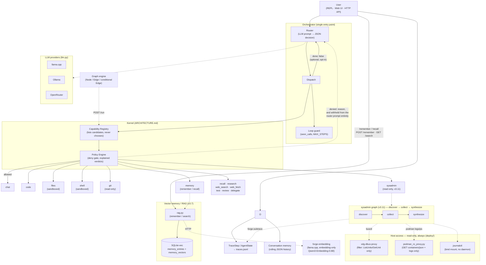

# Architecture

How a turn actually flows through Forge, layer by layer, and why each
boundary is where it is. For the long-term direction -- the micro-kernel
reading of all this -- see [ARCHITECTURE.md](../ARCHITECTURE.md), which
moves at a different speed than the code.

## Architecture

Forge enforces a strict separation between three layers: the **LLM**
(router prompt + providers), **tools** (dispatch + handlers), and **logs**
(the only module allowed to print anything). The orchestrator is the single
point where they meet. From v3.0, execution can also be expressed as a
**Graph** of typed nodes connected by conditional edges.



### The Kernel layer

Dispatch does not look tools up directly any more. Both execution paths — the
orchestrator and the graph engine — ask the **Capability Registry** which
providers answer for a capability name, then consult the **Policy Engine**
before running one. This is Niveau 2 of the trajectory in
[ARCHITECTURE.md](../ARCHITECTURE.md), and it is deliberately the whole of it:
there is no Scheduler yet, because nothing yet needs one.

```
Router decision
      │
      ▼
Capability Registry ──► candidates(name)
      │                 (lists; never chooses)
      ▼
Policy Engine ────────► Verdict(allowed, reason)
      │
      ▼
capability.execute(content) ──► ToolResult
```

The Registry is a **view**, not a snapshot: it derives capabilities from the
enabled tool set at call time and resolves the handler at execution time, so
it cannot go stale. It has no `resolve()` / `best()` / `pick()` — listing and
choosing are different jobs, and choosing belongs to the Cognitive Scheduler
that does not exist yet. A capability with two providers is a hard error today
rather than an implicit pick of the first.

Each tool declares a `REQUIREMENTS` constant: four statically knowable facts
(reaches the Internet, calls the LLM itself, writes to the workspace, spawns a
process). They are declarations, not measurements — cost, latency and quality
scores arrive when something measures them, not before. A tool that declares
nothing gets the most demanding profile and is flagged, so omission is never
mistaken for harmlessness.

```
$ forge capabilities
14 capabilities registered
policy: denying network

   CAPABILITY  PROVIDER    REQUIRES
   chat        chat        local, read-only
   code        code        local, read-only
   delegate    delegate    llm
   files       files       writes
   git         git         subprocess
   memory      memory      local, read-only
   recall      recall      llm
 x research    research    network, llm
   review      review      llm
 x shell       shell       network, llm, writes, subprocess
   sysadmin    sysadmin    llm, subprocess
   test        test        writes, subprocess
 x web_fetch   web_fetch   network
 x web_search  web_search  network

x 4 capabilities are blocked by the active policy and will refuse to run.
```

The Policy Engine is a deny gate over those declarations, and it only ever
subtracts from what `ENABLED_TOOLS` already allows. Its use is context, not
containment — the real sandboxing stays in the tools themselves (`web_fetch`'s
SSRF guard, `files`' workspace confinement, `shell`'s allowlist). Off the
network that hosts SearXNG, `POLICY_ALLOW_NETWORK=false` makes `research` and
`web_search` refuse with a stated reason instead of failing later with a
connection error, while `chat`, `code`, `memory` and `review` keep working.

GitHub renders this diagram automatically; if you're reading this elsewhere, the ASCII
directory tree below covers the same layering.

```
src/forge/
│
├── orchestrator.py      # single orchestrator — MAX_STEPS loop guard + cycle detection + real multi-step (see below)
├── llm.py               # LLM dispatch — called from nowhere else
├── config.py            # sole reader of os.getenv()
├── logger.py            # sole logger; SHOW_DEBUG gates structured trace events
├── errors.py            # typed exception hierarchy (ForgeError, ProviderError, …)
├── types.py             # AgentState / RouterDecision / ToolResult / TraceStep dataclasses
├── trace.py             # JSONL execution trace — one record per run, append-only
│
├── graph.py             # Node / Edge / Graph execution engine
├── graphs/
│   ├── default.py       # router → dispatch → fallback (drop-in for Orchestrator)
│   ├── review.py        # read_file → [run_tests] → llm_review (optional test_path adds the middle step)
│   ├── research.py      # search → fetch top N → synthesize, one deterministic call (v3.10)
│   └── sysadmin.py      # discover → collect → synthesize, read-only always (v3.11)
├── text_cleaning.py     # shared plain-text response cleaning (review.py + research.py + sysadmin.py)
├── subtrace.py          # contextvar side-channel: graph-based tools publish internal
│                         # node steps for the UI without widening the str-only tool contract (v3.11)
│
├── router/
│   ├── prompt.py        # router prompt template — isolated; nothing else builds prompts
│   └── parser.py        # raw LLM output → RouterDecision (5-step cascade)
│
├── tools/
│   ├── registry.py      # discovery + ENABLED_TOOLS allowlist; failures logged, never swallowed
│   ├── chat.py
│   ├── code.py
│   ├── files.py         # sandboxed read/write/list within WORKSPACE_DIR
│   ├── shell.py         # sandboxed subprocess within WORKSPACE_DIR + allowlist
│   ├── git.py           # read-only git operations (status/diff/log/show/branch) — no write counterpart, by design
│   ├── memory.py        # router-dispatchable remember/recall (v3.7) — same rag.py backend
│   ├── test.py          # sandboxed pytest/ruff runner, own allowlist (v3.10)
│   ├── review.py        # dispatchable wrapper around graphs/review.py (v3.10)
│   ├── web_fetch.py      # fetch a known URL, SSRF-guarded (v3.10)
│   ├── web_search.py    # SearXNG-backed search, links/snippets only (v3.10)
│   ├── research.py      # dispatchable wrapper around graphs/research.py (v3.10)
│   ├── sysadmin.py      # dispatchable wrapper around graphs/sysadmin.py (v3.11)
│   ├── recall.py        # dispatchable wrapper around graphs/recall.py
│   └── delegate.py      # dispatchable wrapper around graphs/delegate.py (v3.13) — entry point only
│
├── memory.py            # JSON-backed rolling conversation history + key/value facts
├── rag.py               # SQLite-vec vector memory for decisions/todos (v3.7) — separate concern from memory.py
├── api.py               # FastAPI HTTP server (chat, review, run, traces, tools, remember, search, context, drawer)
├── cli.py               # forge review <file> [--tests <path>] / forge replay <run_id> / forge capabilities
├── main.py              # REPL — !clear, !compact, !trace, !remember, !recall, !capabilities, !help
│
├── turn.py              # one conversational turn, shared by the API and the REPL
├── tokens.py            # local token estimation, checked against llama-server's own counts (v3.12)
├── metrics.py           # per-run inference accounting, surfaced in the trace (v3.12)
├── subtrace.py          # channel letting a graph publish its own node steps to the trace
├── tool_payload.py      # JSON_PAYLOAD_TOOLS + the tolerant payload parse, one source of truth
├── gbnf.py              # grammar checks shared by the router and the delegation spec
├── lang.py              # closed-vocabulary fr/en detection — stays silent when the evidence is thin
├── text_cleaning.py     # strips think blocks and unwraps router-style JSON from a synthesis answer
├── context_info.py      # today's date and other context lines injected into prompts
├── ratelimit.py         # API rate limiting with expiring keys
│
├── delegation.py        # the delegation flow ABOVE the router — answers, approval, cancellation (v3.13)
├── jobs.py              # persisted delegation jobs, its own file rather than a key in memory.json (v3.13)
├── spec.py              # the delegation spec, one source of truth for its fields (v3.13)
├── executors.py         # how a ready job is handed off (v3.13)
├── runner.py            # the thread that runs jobs without blocking the conversation (v3.13)
│
├── kernel/              # Capability layer — see ARCHITECTURE.md
│   ├── capability.py    # Capability interface, Requirements, ToolCapability
│   ├── registry.py      # Capability Registry — lists candidates, never chooses
│   └── policy.py        # Policy Engine — deterministic deny gate, explained verdicts
│
└── providers/
    ├── llama_cpp.py
    ├── ollama.py
    └── openrouter.py
```

`deploy/` (repo root, outside `src/forge/`) holds the read-only host-access
pieces `sysadmin` needs to reach real `journalctl`/`systemctl`/`podman` state
(v3.11) — see [`deploy/README.md`](../deploy/README.md) for the full design and
[Usage](usage.md) for the setup command.

Data flow per turn (orchestrator):
```
user_input
   ↓
Orchestrator._route()      →  RouterDecision   (LLM layer)
   ↓
Orchestrator._dispatch()   →  ToolResult       (capability + policy, then tools layer)
   ↓
done? ──no──→  fold result into history  ──→  route again (up to MAX_STEPS)
   │
  yes
   ↓
AgentResult + TraceStep                         (returned to caller + written to traces.jsonl)
```

**Multi-step is opt-in and backward compatible.** The router's JSON can include
`"done": false` to ask for another step; the tool's result is folded into history as
context for the next routing decision. The field defaults to `true`, so every
extraction path that predates it — plain JSON without `done`, the XML tool-call
format, markdown-fence fallback, plain-text fallback — still returns after exactly
one step, exactly as before. A failed step always stops the run regardless of `done`,
and the existing `seen_calls` loop guard applies across every step, not just within one.

```json
{"tool": "code", "content": "print(1)", "done": false}
```


Data flow per turn (graph):
```
user_input + initial_context
   ↓
Graph.run()  →  Node A  →  Node B  →  … →  terminal node
                  ↓ conditional edges ↑
AgentState.final_output  (+ full trace in AgentState.trace)
```

## Design Philosophy

- **Deterministic routing over free-form reasoning** — the model picks a tool from a fixed set,
  not an open-ended plan.
- **Explicit tool activation** — a tool requires `run()` *and* an `ENABLED_TOOLS` opt-in.
  Code existing is not enough; side-effect tools are never silently reachable.
- **Typed boundaries** — `AgentState`, `RouterDecision`, `ToolResult`, `TraceStep` at every
  interface; raw dicts never cross module boundaries.
- **Best-effort memory and trace** — failures are logged and ignored; they never break a turn.
  Vector memory (v3.7) is the deliberate exception: an unreachable embedding server surfaces as
  a clear error (`502` on the API, a one-line message in the REPL) rather than failing silently —
  a decision that silently wasn't remembered is worse than one that visibly wasn't.
- **Local-first** — llama.cpp and Ollama are first-class backends; no cloud dependency required.
- **Graph over magic** — multi-step flows are expressed as explicit `Node/Edge/Graph` structures,
  not as implicit LLM reasoning loops.

---

[← Documentation index](README.md) · [← Project README](../README.md)
